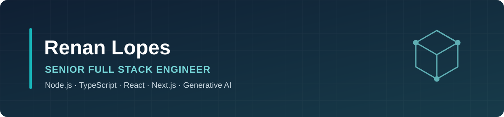

  <a href="https://www.linkedin.com/in/renan-lopes/"><strong>LinkedIn</strong></a>
  &nbsp;·&nbsp;
  <a href="mailto:renanlopesp@gmail.com"><strong>Email</strong></a>
  &nbsp;·&nbsp;
  <a href="https://github.com/renanlopesp?tab=repositories"><strong>Repositories</strong></a>

## Hello, I'm Renan

I'm a **Senior Software Engineer** based in Curitiba, Brazil, with **15+ years of experience** building web products, SaaS platforms, high-traffic content applications, e-commerce systems, APIs, and AI-enabled solutions.

My background combines strong frontend engineering with backend development, systems integration, cloud delivery, and recent hands-on work with Generative AI. I enjoy turning complex business requirements into practical, maintainable software—from interface and API design to production troubleshooting and technical direction.

- **Full Stack:** Node.js, TypeScript, React, Next.js, Python, REST, GraphQL
- **AI Engineering:** LLMs, agents, RAG, function calling, embeddings, semantic search
- **Architecture:** microservices, distributed systems, integrations, security, scalability
- **Delivery:** AWS, Docker, Kubernetes, CI/CD, observability, production support
- **Collaboration:** technical leadership, architecture decisions, product discovery, stakeholder communication

> Most of my enterprise work lives in private repositories. This profile highlights public reference projects and the technologies behind my professional experience.

## Tech stack

### Frontend

  
  
  
  
  
  
  
  
  

### Backend & APIs

  
  
  
  
  
  
  
  
  

### Generative AI & Agentic Systems

  
  
  
  
  
  
  
  
  
  
  

### Data & Persistence

  
  
  
  
  

### Cloud, DevOps & Platform

  
  
  
  
  
  
  
  
  

### Testing & Engineering Practices

  
  
  
  
  

## Selected professional experience

### Senior Technology Consultant — AI Engineering · SuperSkills
`2025–2026` · Remote collaboration with a US-based company

- Built and integrated Generative AI capabilities for multimedia and e-commerce products.
- Developed LLM agents and workflows using RAG, function calling, embeddings, semantic search, and external tools.
- Created services, APIs, proofs of concept, reusable components, and reference architectures with Node.js and Python.
- Worked with product and engineering stakeholders to move ideas from discovery and prototyping toward production.

### Senior Technology Consultant · EY
`2023–2025` · Enterprise digital transformation

- Served as a technical reference in complex and regulated corporate projects, including work delivered for Petrobras.
- Contributed end to end to a React and Python solution for processing and querying large datasets from gas refineries.
- Worked on requirements refinement, data modeling, architecture decisions, APIs, integrations, troubleshooting, and production evolution.
- Established development and documentation practices focused on security, maintainability, and delivery quality.

### Frontend Engineer · Movidesk
`2021–2023` · Customer service SaaS

- Built and evolved React and TypeScript features integrated with REST and GraphQL services.
- Collaborated with product, design, and engineering on usability, consistency, performance, and production support.

### Front-end Developer · NZN
`2020–2021` · High-traffic digital media

- Developed React and Next.js applications for content products with a large audience.
- Worked with SSR, responsive interfaces, API integrations, web performance, and application stability.

<strong>Earlier experience</strong>

 

- **Agência Polvo — Front-end Developer (2018–2020):** responsive websites and web applications for clients across multiple industries.
- **SpiritShop Ecommerce Solutions — Web Developer (2012–2018):** full stack development and support for e-commerce platforms, including storefronts, business rules, APIs, databases, catalog, and checkout journeys.

## Public projects

<table>
<tr>
<td width="50%" valign="top">

### [LLM Embeddings Proxy](https://github.com/renanlopesp/llm-embeddings-proxy)

OpenAI-compatible embeddings proxy with bearer-token protection, health checks, environment-based configuration, and Docker deployment.

`Node.js` `OpenAI API` `Embeddings` `Docker`

</td>
<td width="50%" valign="top">

### [TypeGraphQL User Login](https://github.com/renanlopesp/user-login-typescript)

Authentication reference covering registration, confirmation, login, sessions, password recovery, GraphQL complexity control, and automated tests.

`TypeScript` `GraphQL` `Express` `Apollo` `Redis` `TypeORM` `Jest`

</td>
</tr>
</table>

## What I bring to a team

- Hands-on implementation across frontend, backend, integrations, and AI capabilities
- Senior-level ownership of ambiguous and technically complex problems
- Experience with enterprise consulting and long-lived product codebases
- Clear communication between engineering, product, design, and business stakeholders
- Focus on pragmatic architecture, maintainability, reliability, and measurable product value

## Education

- **Technology degree in Multimedia Production** — Centro Universitário UniOpet
- **Machine Learning specialization coursework** — Centro Universitário UniOpet

## Current focus

I am currently focused on:

- production-oriented applications with Node.js, TypeScript, React, and Next.js;
- LLM agents, RAG pipelines, function calling, and semantic retrieval;
- reliable APIs, observability, developer experience, and scalable architecture.

## Let's connect

I'm open to remote opportunities involving **Senior Software Engineering, Full Stack Development, Frontend Engineering, or AI-enabled product development**.

- **LinkedIn:** [linkedin.com/in/renan-lopes](https://www.linkedin.com/in/renan-lopes/)
- **Email:** [renanlopesp@gmail.com](mailto:renanlopesp@gmail.com)
- **Location:** Curitiba, Brazil
